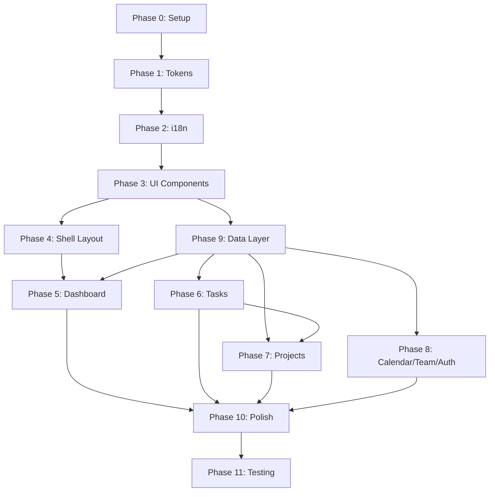

# LUMINA AI — Implementation Plan

> **Dự án:** Task Management Web App  
> **Nguồn spec:** `design_system_consolidated.md` + `phase_4_consolidated.md` (color system) + `phase_5_consolidated.md` (typography) + `phase_6_consolidated.md` (component style guide)  
> **Nguyên tắc:** Mỗi phase có output rõ ràng, verify được trước khi sang phase tiếp

---

# TECH STACK

| Layer | Công nghệ | Lý do |
|-------|-----------|-------|
| **Framework** | Next.js 15 (App Router) | SSR/SSG, nested layouts, server actions, SEO ready |
| **Language** | TypeScript 5.x | Type safety cho design tokens, API types, component props |
| **Routing** | Next.js App Router | File-based routing, nested layouts, parallel routes |
| **i18n** | next-intl | Đa ngôn ngữ: Tiếng Việt + Tiếng Anh, SSR-compatible |
| **State (client)** | Zustand | Lightweight, không boilerplate, tốt cho sidebar/theme/modal state |
| **State (server)** | TanStack Query v5 | Cache, refetch, stale-while-revalidate cho dashboard widgets |
| **Styling** | Tailwind CSS v4 + CSS Custom Properties | Utility-first, design tokens map thành Tailwind theme |
| **UI Library** | shadcn/ui | Accessible components (Radix UI), customizable, không bloat |
| **Charts** | Recharts | React-native charts, responsive, customizable, lightweight |
| **Animation** | Framer Motion | Pulse Ring, Confidence Glow, page transitions, skeleton shimmer |
| **Icons** | Lucide React | Consistent icon set, tree-shakeable |
| **Fonts** | next/font (local) | Lexend Deca (headings) + Inter (body) + JetBrains Mono (data/code) — auto-optimize |
| **Date** | date-fns | Lightweight date formatting, no moment.js |
| **Forms** | React Hook Form + Zod | Validation cho task/project creation |
| **Testing** | Vitest + React Testing Library + Playwright | Unit + integration + E2E |
| **Linting** | ESLint + Prettier | Code quality |
| **Build** | Next.js (Turbopack) | Fast HMR, optimized production builds |

### Tại Sao Next.js?

- **App Router** cho nested layouts chuẩn — Sidebar/Topbar layout dùng chung, mỗi page chỉ render content
- **Server Components** giảm JS bundle — dashboard widgets fetch data server-side
- **next-intl** tích hợp sẵn routing i18n (`/vi/dashboard`, `/en/dashboard`)
- **next/font** tự optimize fonts, không cần self-host thủ công
- **SEO** nếu sau này cần public pages (landing, pricing)

### Tại Sao Tailwind CSS + shadcn/ui?

- **Tailwind v4** — CSS-first config, tích hợp CSS custom properties trực tiếp, không cần `tailwind.config.js`
- **Design tokens** map thành Tailwind theme variables (`--color-brand-primary` → dùng trong `bg-brand-primary`)
- **shadcn/ui** — Không phải library, là **copy-paste components** dựa trên Radix UI primitives
  - Có sẵn: Button, Dialog, Select, Tooltip, Badge, Command (⌘K), Toast, Skeleton, Avatar, Progress, Card
  - Accessible by default (ARIA, keyboard nav, focus management)
  - Full ownership — customize thoải mái, không bị lock-in
- OKLCH colors vẫn hoạt động trong Tailwind v4 CSS layer

---

# PAGES & FEATURES

## Sitemap Tổng Quan

```
/[locale]                          → Dashboard (trang chủ)
/[locale]/tasks                    → Task List (all tasks)
/[locale]/tasks/[id]               → Task Detail
/[locale]/tasks/new                → Create Task
/[locale]/projects                 → Project List
/[locale]/projects/[id]            → Project Board (Kanban)
/[locale]/projects/[id]/settings   → Project Settings
/[locale]/calendar                 → Calendar View
/[locale]/team                     → Team Overview
/[locale]/settings                 → User Settings
/[locale]/settings/profile         → Profile Settings
/[locale]/settings/preferences     → Notification & Theme Preferences
/[locale]/login                    → Login Page
/[locale]/register                 → Register Page
```

> `[locale]` = `vi` hoặc `en`. Mặc định: `vi`. URL ví dụ: `/vi/tasks`, `/en/tasks`

## Chi Tiết Từng Page

### 1. Dashboard (`/`)

| Khu vực | Chức năng | Component |
|---------|-----------|-----------|
| Hero Stats Row | 4 stat cards: Total Tasks, Completed, In Progress, Overdue | `StatCard` × 4 |
| AI Insights Panel | 3 AI suggestions với confidence glow | `AIInsightCard` |
| Task Overview | Donut chart phân bổ trạng thái + task list top 5 | `TaskOverviewWidget` |
| Weekly Progress | Area chart 7 ngày, so sánh target vs actual | `WeeklyProgressChart` |
| Upcoming Deadlines | List 5 deadline gần nhất, pulse ring cho urgent | `DeadlineList` |
| Recent Activity | Activity feed, decay opacity cho items cũ | `ActivityFeed` |
| Team Workload | Horizontal bar chart per member | `TeamWorkloadChart` |
| Quick Actions (FAB) | Floating button → Create Task, Create Project | `QuickActionsFAB` |

**States:** Skeleton loading, error card + retry, empty state per widget

---

### 2. Task List (`/tasks`)

| Chức năng | Mô tả |
|-----------|-------|
| Filters | Status (To Do / In Progress / In Review / Done), Priority (High/Med/Low), Assignee, Due date range |
| Sort | By due date, priority, created date, title |
| Search | Full-text search by task title/description |
| Bulk actions | Select multiple → change status, assign, delete |
| View toggle | List view ↔ Board view (Kanban) |
| Pagination | Virtual scroll hoặc infinite scroll |

---

### 3. Task Detail (`/tasks/:id`)

| Chức năng | Mô tả |
|-----------|-------|
| Title + Description | Editable inline |
| Status | Dropdown: To Do → In Progress → In Review → Done |
| Priority | Badge: High (red), Medium (amber), Low (blue) |
| Assignee | Avatar + dropdown select |
| Due date | Date picker |
| Project | Link to parent project |
| Subtasks | Checklist với progress bar |
| Comments | Threaded comments với timestamps |
| Activity log | History of changes |
| AI suggestions | Contextual AI tips (deadline risk, workload balance) |

---

### 4. Create/Edit Task (`/tasks/new`, modal hoặc page)

| Field | Type | Validation |
|-------|------|-----------|
| Title | Text input | Required, max 200 chars |
| Description | Textarea (rich text optional) | Optional |
| Status | Select | Default: To Do |
| Priority | Select | Default: Medium |
| Assignee | User select | Optional |
| Due date | Date picker | Optional, must be future |
| Project | Project select | Optional |
| Tags | Multi-select / create | Optional |

---

### 5. Project List (`/projects`)

| Chức năng | Mô tả |
|-----------|-------|
| Project cards | Card grid: name, description, member avatars, task count, progress bar |
| Create project | Modal: name, description, color, members |
| Filters | By status (active/archived), member |
| Sort | By name, created date, activity |

---

### 6. Project Board (`/projects/:id`)

| Chức năng | Mô tả |
|-----------|-------|
| Kanban columns | To Do → In Progress → In Review → Done |
| Drag & Drop | Kéo task giữa columns (dnd-kit library) |
| Column task count | Badge count per column |
| Quick add | Inline add task at top of column |
| Project header | Name, description, member list, settings link |
| Filters | Same as Task List but scoped to project |

**Thư viện bổ sung:** `@dnd-kit/core` + `@dnd-kit/sortable` cho drag & drop

---

### 7. Calendar View (`/calendar`)

| Chức năng | Mô tả |
|-----------|-------|
| Month view | Calendar grid với task dots trên due dates |
| Week view | Timeline với task blocks |
| Day view | Detailed list of tasks for selected day |
| Click task | Open task detail modal |
| Drag to reschedule | Kéo task sang ngày khác |

**Thư viện:** `@fullcalendar/react` + `@fullcalendar/daygrid` + `@fullcalendar/timegrid` + `@fullcalendar/interaction` — có sẵn month/week/day views + drag-to-reschedule

---

### 8. Team Overview (`/team`)

| Chức năng | Mô tả |
|-----------|-------|
| Member list | Avatar, name, role, workload bar |
| Workload chart | Horizontal bar per member (reuse from Dashboard) |
| Invite member | Email invite form |
| Role management | Admin / Member role toggle |

---

### 9. Settings (`/settings`)

| Sub-page | Chức năng |
|----------|-----------|
| `/settings/profile` | Avatar upload, name, email, password change |
| `/settings/preferences` | Theme toggle (light/dark/system), notification preferences, language |

---

### 10. Login (`/login`) & Register (`/register`)

| Chức năng | Mô tả |
|-----------|-------|
| Login form | Email + password, "Remember me", "Forgot password" link |
| Register form | Name + email + password + confirm password |
| Validation | Inline errors (Zod schema) |
| Protected routes | Redirect to `/login` if unauthenticated |
| Theme | Follows system dark/light, brand gradient background |

---

# SHARED COMPONENTS LIBRARY

| Component | Dùng ở | Props chính |
|-----------|--------|-------------|
| Component | Nguồn | Customize |
|-----------|-------|----------|
| `Button` | shadcn/ui | Thêm variant `danger`, map colors → design tokens |
| `Card` | shadcn/ui | Thêm AI variant (gradient border, glow) |
| `Input` | shadcn/ui | Style theo tokens (height, radius, focus ring) |
| `Select` | shadcn/ui | Searchable select, multiple select |
| `Badge` | shadcn/ui | Thêm variant priority (high/med/low), status, AI |
| `Avatar` | shadcn/ui | Size S/M/L, fallback initials |
| `Tooltip` | shadcn/ui | Delay 200ms, max-width 240px |
| `Dialog` (Modal) | shadcn/ui | Size sm/md/lg, backdrop blur |
| `Sonner` (Toast) | shadcn/ui | 4 types, auto-dismiss 5s, status border |
| `Progress` | shadcn/ui | Auto color by load level |
| `Skeleton` | shadcn/ui | Shimmer animation |
| `Command` (⌘K) | shadcn/ui | Search + keyboard nav, powered by cmdk |
| `EmptyState` | **Custom** | Icon + message + action button |
| `ErrorCard` | **Custom** | Dashed border + retry + last updated |
| `Sidebar` | shadcn/ui | Collapsible, mobile overlay, rail mode |
| `Topbar` | **Custom** | Sticky, glass blur, breadcrumb, search |

---

# IMPLEMENTATION PHASES

---

## Phase 0: Project Setup

- [ ] Init Next.js 15 + TypeScript project (`npx -y create-next-app@latest ./ --typescript --app --src-dir --no-tailwind`) → Verify: `npm run dev` opens blank page
- [ ] Install core dependencies (next-intl, zustand, @tanstack/react-query, framer-motion, recharts, lucide-react, date-fns, react-hook-form, zod, @dnd-kit/core, @dnd-kit/sortable) → Verify: `npm run build` succeeds
- [ ] Setup ESLint + Prettier config → Verify: `npm run lint` passes
- [ ] Setup folder structure:
  ```
  src/
    app/
      [locale]/             ← i18n dynamic segment
        (auth)/             ← Auth route group (no layout shell)
          login/page.tsx
          register/page.tsx
        (app)/              ← Main app route group (with shell layout)
          layout.tsx        ← Sidebar + Topbar wrapper
          page.tsx          ← Dashboard
          tasks/
          projects/
          calendar/
          team/
          settings/
        layout.tsx          ← Root locale layout (providers, fonts)
      layout.tsx            ← HTML root
    components/
      ui/                   ← Shared UI components
      layout/               ← Shell (Sidebar, Topbar)
      widgets/              ← Dashboard widgets
    hooks/                  ← Custom hooks
    stores/                 ← Zustand stores
    services/               ← API client + mock data
    styles/                 ← CSS files + tokens
    types/                  ← TypeScript types
    utils/                  ← Helper functions
    i18n/                   ← next-intl config
    messages/               ← Translation JSON files
      vi.json
      en.json
  ```
- [ ] Setup Vitest config → Verify: `npm run test` runs (0 tests)

---

## Phase 1: Design Tokens + Global Styles

- [ ] Create `styles/palettes/` — 6 palette CSS files (mỗi file chứa `[data-palette="xxx"]` với dark/light tokens từ `phase_4_consolidated.md`):
  - `arctic-violet.css` (default) ← TOP RECOMMENDATION
  - `ember-gold.css` ← #2 RECOMMENDATION
  - `midnight-mint.css`
  - `ocean-blue.css`
  - `neon-coral.css`
  - `phantom-slate.css`
  → Verify: Mỗi file chứa đầy đủ tokens (surfaces, text, brand, status, priority, borders, glass, gradients) cho cả light + dark mode
- [ ] Create `styles/tokens.css` — Import tất cả 6 palette files + shared tokens (spacing, shadows, z-index, Living Constellation tokens) → Verify: `globals.css` import thành công
- [ ] Create `styles/component-system.css` — System-wide component rules từ `phase_6_consolidated.md`:
  - **Radius ladder:** `--radius-xs: 4px` (checkbox) → `--radius-sm: 6px` (badge) → `--radius-md: 8px` (button/input) → `--radius-kanban: 10px` (kanban cards) → `--radius-lg: 12px` (card/menu/toast/table) → `--radius-xl: 16px` (modal/sidebar-right) → `--radius-2xl: 20px` (AI cards)
  - **3-tier shadow scale:** `--shadow-sm` (switch thumbs, table shells, kanban), `--shadow-md` (buttons, cards on canvas), `--shadow-lg` (modals, toasts, dropdown menus)
  - **Motion timing system:** Color/border/shadow: `80–100ms`, Transform/indicator: `160–180ms`, Layout (sidebar expand): `220–260ms`
  - **Shared focus ring:** 2-layer treatment — `2px ring-offset` + `2px ring` in `brand-primary`, neutral inner separation layer, visible trên dark/glass/semantic surfaces
  - **Empty state pattern:** AI onboarding flow ("Tạo task đầu tiên, tôi sẽ giúp bạn" + suggested templates) thay vì static illustrations
  - **Light mode rules:** Keep geometry + spacing unchanged, swap surface tokens, reduce shadow opacity 35-40%, subtle outline on glass cards, brand glow reduced
  → Verify: CSS variables resolving correctly, focus ring visible trên mọi surface
- [ ] Create `styles/typography.css` — Typography system từ `phase_5_consolidated.md`:
  - Font families: `--font-display` (Lexend Deca), `--font-body` (Inter), `--font-mono` (JetBrains Mono)
  - 14 type scale tokens (`display-xl` → `stat-label`), line-heights, letter-spacing
  - Utility classes (`.text-display-xl`, `.text-body-md`, `.text-stat-value`, etc.)
  - Mobile responsive scaling (≤640px: base 13px, factor 0.92)
  → Verify: Utility classes render correct font/size/weight combinations
- [ ] Create `styles/globals.css` — Base styles, reset, reduced-motion, scrollbar → Verify: CSS variables accessible trong browser
- [ ] Setup Tailwind v4 CSS config:
  - Map semantic colors → CSS variables (per `phase_4_consolidated.md` section 4b)
  - Map font families + fontSize với lineHeight/letterSpacing (per `phase_5_consolidated.md` section 6)
  → Verify: Both `bg-brand-primary` và `text-display-lg` classes render correctly
- [ ] Setup fonts via `next/font/local`:
  - Lexend Deca (600, 700) — headings ≥20px
  - Inter (400, 500, 600) — body/UI
  - JetBrains Mono (400, 500) — numbers/code/timestamps
  - **7 weights total** (under 8 budget)
  - Preload: Inter 400 + Lexend Deca 600 (critical FCP)
  - Lazy-load: JetBrains Mono (chỉ cần trên stats/code screens)
  → Verify: No external font requests, correct fonts render
- [ ] Dark/light theme via `[data-theme]` attribute (`light` | `dark` | system auto-detect via `prefers-color-scheme`) → Verify: Toggle thay đổi surface/text colors
- [ ] Palette switcher via `[data-palette]` attribute — `setTheme(mode, palette)` function + localStorage persist → Verify: Đổi palette, refresh trang, palette vẫn giữ

---

## Phase 2: i18n Setup (Đa Ngôn Ngữ)

- [ ] Cấu hình `next-intl` — `i18n/request.ts` + `middleware.ts` (locale detection, default `vi`) → Verify: `/vi` và `/en` đều truy cập được
- [ ] Tạo `messages/vi.json` — Tất cả UI strings tiếng Việt (nav, buttons, labels, placeholders, errors, dashboard widget titles) → Verify: File JSON hợp lệ
- [ ] Tạo `messages/en.json` — Bản tiếng Anh tương ứng → Verify: Cùng structure keys với `vi.json`
- [ ] Wrap root layout với `NextIntlClientProvider` → Verify: `useTranslations()` hook hoạt động trong component
- [ ] Language switcher component — Dropdown VI/EN trong Topbar hoặc Settings → Verify: Chuyển ngôn ngữ, URL đổi (`/vi/tasks` ↔ `/en/tasks`), UI text thay đổi
- [ ] Date/time locale — `date-fns` format theo locale (vi: "16 tháng 3", en: "March 16") → Verify: Dashboard timestamps đúng ngôn ngữ

---

## Phase 3: shadcn/ui + Shared Components

> **Source:** `phase_6_consolidated.md` — mỗi component implement đầy đủ size variants, states, transitions, accessibility rules.

- [ ] Init shadcn/ui (`npx shadcn@latest init`) — chọn style "default", base color custom → Verify: `components.json` tạo thành công
- [ ] Install shadcn components: `npx shadcn@latest add button card input select badge avatar tooltip dialog sonner progress skeleton command sidebar toggle tabs checkbox` → Verify: Files xuất hiện trong `src/components/ui/`

### Button
- [ ] Customize Button — 3 sizes (S: 32px/12px-pad, M: 40px/16px-pad, L: 48px/20px-pad) + radius `8px` + 5 variants:
  - **Primary:** `brand-primary` fill, `brand-hover` on hover
  - **Secondary:** `bg-surface-2` fill, 1px `border-default`
  - **Ghost:** transparent, text-only, hover `bg-surface-1`
  - **Danger:** `status-error` fill
  - **AI action:** transparent fill + gradient border (`brand-primary → violet-400`) + restrained `shadow-md` glow on hover
  - **States:** default, hover, pressed (scale 0.98 + shadow-sm), focus (2-layer ring), disabled (50% opacity, no pointer), loading (spinner replaces label)
  - **Transitions:** background/border/shadow: `80–100ms`, transform (pressed): `100ms`
  - **Accessibility:** Focus ring visible trên mọi variant, disabled buttons vẫn render không phải display:none
  → Verify: Render tất cả 5 variants × 3 sizes × 6 states, AI button gradient visible

### Card
- [ ] Customize Card — 3 variants:
  - **Default:** `bg-surface-1`, 1px `border-default`, `shadow-md`, radius `12px`
  - **Glass:** `bg-glass`, `backdrop-blur`, high-opacity dark glass with inner dark wash under text
  - **AI card:** gradient border 2-3px (`brand-primary → violet-400`), `shadow-md` glow, radius `20px`, confidence glow intensity varies
  - **Sizes:** Compact (12px pad, 10px radius), Default (16px pad, 12px radius), Large (20px pad, 12px radius)
  - **States:** default, hover (border brightens + shadow lifts `shadow-lg`), selected (brand-tinted border), loading (skeleton fill), error (dashed `status-error` border)
  - **Transitions:** shadow/border: `100ms`, hover lift transform: `160ms`
  → Verify: AI card có gradient, glass card readable trên varied backgrounds

### Input / Textarea
- [ ] Customize Input — 3 sizes (S: 32px, M: 40px, L: 48px) + radius `8px`:
  - **Background:** `bg-surface-2` (darker than page)
  - **Border:** 1px `border-default` → `border-hover` on hover → `brand-primary` on focus (2px)
  - **Focus:** Outer glow ring `brand-primary/20%` + border thickens to 2px
  - **Error:** `status-error` border + red ring, helper text below
  - **States:** default, hover, focus, filled, disabled (reduced opacity + `not-allowed`), error, readonly
  - **Text:** placeholder `text-tertiary`, value `text-primary`, label `body-sm 500`
  - **Transitions:** border/shadow: `80–100ms`
  → Verify: Focus ring visible, error state shows red border + helper text

### Badge / Tag
- [ ] Customize Badge — 3 sizes (S: 20px/6px-pad, M: 24px/8px-pad, L: 28px/10px-pad) + radius `6px`:
  - **Variants:** neutral, status (success/warning/error/info), priority (high/med/low colors), AI (gradient border + faint glow)
  - **Sub-variants:** solid fill vs outline (1px border + transparent)
  - **Removable tags:** small ✕ ghost icon 6px from label, hover darkens
  - **Text:** single-line truncated, `caption` or `body-sm`, `text-primary`
  - **Transitions:** opacity on mount: `80–100ms`
  → Verify: All variants correct colors, removable badge callback fires

### Avatar
- [ ] Customize Avatar — 3 sizes (S: 24px, M: 32px, L: 40px) + fully rounded:
  - **Image:** cover-fit, 1px `border-default` ring
  - **Fallback initials:** `bg-surface-2`, centered `caption`/`body-sm` 600
  - **Group stack:** overlap by 25%, z-index ascending, "+N" overflow counter
  - **Status dot:** bottom-right, 3 sizes (6/8/10px), green/amber/grey + 2px `bg-surface-1` ring
  - **States:** default, hover (slight lift), loading (skeleton circle), error (initials fallback)
  → Verify: Group stack overlaps correctly, status dot visible on all sizes

### Tooltip
- [ ] Customize Tooltip — radius `8px`, dark `bg-surface-2`/`bg-surface-3`, 1px `border-default`:
  - **Max width:** 240px, padding 8-12px
  - **Text:** `caption` or `body-sm`, `text-primary`, title in 600 weight
  - **Shadow:** `shadow-md`
  - **Delay:** hover show `250ms`, hover exit `100ms`, keyboard focus: immediate
  - **Positioning:** top/right/bottom/left, flip if constrained
  - **Animation:** opacity + 2-4px positional shift: `80–120ms`
  - **Accessibility:** `aria-describedby`, no essential-only info, rich tooltips behave as popovers
  → Verify: Delay timing correct, flips when near edge

### Dialog (Modal)
- [ ] Customize Dialog — 3 sizes:
  - **S:** 400px wide, 16px padding
  - **M:** 560px wide, 20px padding (default)
  - **L:** 720px wide, 24px padding
  - **Radius:** `16px`, backdrop blur 4px + dark overlay `oklch(0 0 0 / 0.5)`
  - **Shadow:** `shadow-lg` (strongest)
  - **Header:** title `heading-sm`/`heading-md`, optional subtitle `body-sm text-secondary`, 12px header-to-body gap
  - **Footer:** right-aligned buttons, 8px gap between actions
  - **States:** entering (scale 0.95→1 + fade), visible, exiting (reverse), scrollable body if content overflows
  - **Transitions:** scale + fade: `160–180ms`
  - **Accessibility:** focus trap, ESC closes, `aria-modal`, return focus to trigger
  → Verify: ESC closes, Tab cycles inside, scroll only in body

### Toast (Sonner)
- [ ] Customize Sonner — 3 sizes (S: 280px, M: 360px, L: 440px) + radius `12px`:
  - **5 variants:** success, error, warning, info, AI insight (violet gradient edge + ambient glow)
  - **Auto-dismiss:** success/info 4s, warning 6s, AI insight 6s, error 8s (or persistent for critical)
  - **Shadow:** `shadow-lg`, max visible toasts: **3**, stack gap 12px
  - **Enter:** fade + slide from top-right, Exit: upward fade, `160-180ms`
  - **Hover:** pause auto-dismiss, clarify border
  - **Close button:** small ghost icon, always available
  - **Accessibility:** `role="status"` for neutral/success, `role="alert"` for warnings/errors
  → Verify: Auto-dismiss timing, hover pauses timer, max 3 toasts stacked

### Table
- [ ] Build Table component — 3 sizes (S: 36px rows, M: 44px rows, L: 52px rows) + radius `12px` outer shell:
  - **Header:** `bg-surface-2`, `caption`/`body-sm` 600, `text-secondary`
  - **Rows:** transparent, hover brightness, selected brand-tinted wash
  - **Border:** 1px outer `border-default`, soft horizontal row separators, no vertical gridlines
  - **Text:** `body-sm`/`body-md`, numeric columns use Mono, single-line truncation
  - **Sortable:** unsorted icon faint on hover, sorted icon always visible, `aria-sort`
  - **Sticky header:** `bg-surface-2` with stronger bottom border on scroll
  - **States:** default, hover row, selected row (checkbox), active sort, focus, disabled row, loading (skeleton rows), empty (shared empty state inside shell)
  - **Shadow:** `shadow-sm` for table shell
  → Verify: Sticky header on scroll, sort icons visible, empty state inside shell

### Dropdown Menu
- [ ] Build Dropdown — 3 sizes (S: 28px items, M: 32px items, L: 36px items) + radius `12px` panel, `8px` item hover:
  - **Variants:** action menu, context menu, select menu
  - **Background:** `bg-surface-1`, hovered items `bg-surface-2`, selected brand-tinted
  - **Shadow:** `shadow-lg`, submenus same elevation
  - **Text:** `body-sm`/`body-md`, shortcuts `caption text-tertiary` right-aligned, destructive items `status-error` tinted
  - **Nested sub-menus:** open right, align top, short delay
  - **Animation:** scale + fade from trigger: `120–160ms`
  - **Accessibility:** menu semantics for actions, listbox for selects, arrow keys, Enter/Space, Escape
  → Verify: Submenu opens right, destructive items red-tinted, ESC closes

### Progress / Loading
- [ ] Customize Progress — Linear bar + Spinner + Skeleton + AI thinking dots:
  - **Linear:** track `bg-surface-2`, fill `brand-primary`, S: 4px, M: 6px, L: 8px
  - **Spinner:** S: 16px, M: 20px, L: 24px, faint track + brand arc
  - **Skeleton:** shimmer slightly brighter than base, mirror eventual content rhythm
  - **AI thinking:** 3 pulsing dots in `brand-primary`, staggered `700–900ms/cycle`, compact
  - **States:** determinate, indeterminate (moving segment), paused, complete, error
  - **Color by load level:** 0-60% blue, 61-85% green, 86-100% amber, >100% red
  - **Accessibility:** progressbar semantics with value, skeletons hidden from screen readers
  → Verify: Auto color by level, AI dots pulse correctly, skeleton rhythm matches content

### Toggle / Switch
- [ ] Customize Toggle — 2 sizes (S: 28×16px track/12px thumb, M: 36×20px track/16px thumb), fully rounded:
  - **Off:** `bg-surface-2`, **On:** `brand-primary`, **Hover:** brighter surface / `brand-hover`
  - **Thumb:** `shadow-sm` for separation, snappy translate (no spring/elastic)
  - **Label:** `body-sm`/`body-md` right-aligned preferred, optional caption below
  - **Transitions:** track color `80–100ms`, thumb translate `120–160ms`
  - **States:** off, off-hover, on, on-hover, pressed, focus, disabled, loading (freeze + track pulse)
  - **Accessibility:** switch semantics, entire row clickable, focus ring visible on On state
  → Verify: Snap feel (no bounce), disabled state shows, thumb shadow visible

### Tabs
- [ ] Customize Tabs — 2 variants:
  - **Underline:** S: 32px, M: 36px, L: 44px, active underline `2px brand-primary`, **slides** (not blinks) `160ms`
  - **Pill/Segment:** group `bg-surface-2`, active raised inner fill, radius `8px`
  - **Text:** inactive `text-secondary`, active `text-primary`, optional badge counts
  - **Overflow:** horizontal scroll + gradient edge fades or arrow hints
  - **States:** default, hover (label brightens), active (indicator), pressed, focus (ring), disabled, loading
  - **Accessibility:** tablist/tab/tabpanel semantics, arrow key navigation
  → Verify: Underline slides on switch, pill segment transitions, overflow arrows appear

### Checkbox / Radio
- [ ] Customize Checkbox + Radio — 3 sizes (S: 16px/24px hit, M: 18px/28px hit, L: 20px/32px hit):
  - **Checkbox radius:** `4px`, **Radio:** fully circular
  - **Unchecked:** `bg-surface-2`, 1.5px `border-default`
  - **Checked:** `brand-primary` fill, white checkmark (2px stroke) or radio dot (~40% diameter)
  - **Indeterminate (checkbox):** `brand-primary` + horizontal dash
  - **Error:** error-tinted border + ring
  - **Icon animation:** snap in with brief scale-up `120ms` with slight overshoot
  - **Group:** checkbox groups = fieldset/legend, radio groups = radiogroup, stacked 8-12px gap
  - **States (9):** unchecked, unchecked-hover, checked, checked-hover, indeterminate, focus, disabled-unchecked, disabled-checked, error
  - **Accessibility:** native semantics or ARIA, `aria-invalid` + `aria-describedby` for errors, `aria-checked="mixed"` for indeterminate, hit area ≥24×24px
  → Verify: Checkmark scale-in animation, indeterminate dash, 9 states all render

### Custom Components
- [ ] Build `EmptyState` (custom) — AI onboarding flow: "Tạo task đầu tiên, tôi sẽ giúp bạn" + suggested templates + action button → Verify: Render with/without AI suggestions
- [ ] Build `ErrorCard` (custom) — Dashed `status-error` border + retry button + last updated timestamp → Verify: Retry triggers callback

---

## Phase 4: Shell Layout

> **Source:** `phase_6_consolidated.md` (sections 6-7) + `phase_8_consolidated.md` (pixel-exact Sidebar & Topbar specification)

### Sidebar — Spatial Blueprint

- [ ] Customize shadcn `Sidebar` — 3 breakpoint states:

  | Breakpoint | Width | Position | z-index | Default State |
  |------------|-------|----------|---------|---------------|
  | Desktop ≥1025px | Expanded: 240px, Collapsed: **56px** | fixed left:0, top:0, bottom:0 | 30 | Expanded |
  | Tablet 641–1024px | Expanded: 240px, Collapsed: **56px** | fixed left:0, top:0, bottom:0 | 30 | Expanded |
  | Mobile ≤640px | Hidden default, overlay: 240px | fixed left:0, top:0, bottom:0 | 50 | Hidden |

  - **Internal layout:** Vertical flex column, 3 pinned zones:
    - `logo-zone` (64px, pad 0 16px, pinned) — Logo 32×32 + "LuminaAI" `body-md`
    - `nav-zone` (flex-grow, pad 8px 0, scrollable) — 10 nav items + 2 section overlines
    - `bottom-zone` (64px, pad 16px, pinned) — Settings + Collapse toggle
  - Zone gap: 16px between zones, nav items gap: 4px
  - **Radius:** left edge `0px` (flush viewport), right edge `16px` (organic curve)
  - **Background:** `bg-surface-1`, border-right 1px `border-subtle`

- [ ] Navigation structure — 10 items in 2 sections (Lucide icons):

  | Section | Icon (Lucide) | Label | Badge | AI Indicator |
  |---------|---------------|-------|-------|--------------|
  | **MAIN** | LayoutDashboard | Dashboard | — | — |
  | | ListChecks | Tasks | 3 | ✔ |
  | | Folder | Projects | — | — |
  | | Users | Team | — | — |
  | | Star | Favorites | — | — |
  | **AI TOOLS** | Zap | Automations | 1 | ✔ |
  | | BarChart2 | Analytics | — | ✔ |
  | | Calendar | Calendar | — | — |
  | | MessageCircle | Chat | 2 | — |

  - Expanded: text `body-md`, icon 20px + label, section overlines `caption-sm`
  - Collapsed: labels hidden (opacity 0), icons centered in 56px, badges → 8×8 dots (no count), section overlines hidden
  - AI indicator: subtle glow `brand-primary-glow` 2px left of icon
  - Badge: 18×18, radius 999px, `brand-primary-subtle` bg, `caption` text
  - Total height: 596px (fits 900px viewport without scroll) ✅

- [ ] Nav item 5-state matrix:

  | State | Background | Text | Left Indicator | Extra |
  |-------|-----------|------|----------------|-------|
  | Default | `bg-surface-1` | `text-primary` | none | — |
  | Hover | `bg-surface-3` | `text-primary` | none | AI items: subtle glow |
  | Active | `brand-primary-subtle` | `brand-primary` | 3px bar, radius 2px | font-weight 500 |
  | Pressed | `bg-surface-3` | `brand-primary` | 3px bar | scale(0.98) 80ms |
  | Focus | `bg-surface-3` | `text-primary` | 2px outline `brand-primary` | keyboard only |

  - Active indicator: animated `translateY` between items, 160ms ease
  - Color transitions: 100ms ease
  - Scroll shadow: 8px gradient from `bg-surface-1` at top/bottom of `nav-zone` when overflow detected
  - Nav item: 36px height, 8px 12px padding, 8px radius, 36×36 hit area (collapsed)
  → Verify: Active item shows brand-primary bg + 3px left bar, hover shows `bg-surface-3`

- [ ] Collapse/expand mechanics:

  | Property | Value |
  |----------|-------|
  | Trigger | Bottom-zone ChevronsLeft button (32×32) |
  | Keyboard | `⌘\` (Cmd+Backslash) |
  | Auto-collapse | Below 641px → hidden entirely |
  | Width animation | 240→56px, 220ms ease-out |
  | Label opacity | 160ms fade |
  | Active indicator | 3px left bar persists; translateY 160ms ease |
  | Tooltip (collapsed) | `bg-surface-2`, `shadow-md`, 160ms delay |

- [ ] Mobile overlay mechanics:

  | Property | Value |
  |----------|-------|
  | Open trigger | Hamburger icon in Topbar |
  | Close triggers | ✕ button in logo-zone + backdrop tap + swipe left |
  | Backdrop | `rgba(0,0,0,0.3)` |
  | Slide-in | `translateX(-240→0)`, 260ms ease-out |
  | Content behind | `body overflow: hidden` (no scroll) |

- [ ] Cross-component coordination:

  | Event | Sidebar | Content Area | Topbar |
  |-------|---------|-------------|--------|
  | Collapse | width 240→56, 220ms | margin-left 240→56, 220ms (sync) | unchanged |
  | Expand | width 56→240, 220ms | margin-left 56→240, 220ms | unchanged |
  | Mobile open | translateX(-240→0), 260ms | body overflow: hidden | unchanged |
  | Mobile close | translateX(0→-240), 220ms | body overflow: auto | unchanged |

  → Verify: Content area offset transitions in sync with sidebar, mobile overlay blocks body scroll

### Topbar — Spatial Blueprint

- [ ] `Topbar` (custom) — Sticky header:

  | Breakpoint | Height | Width | z-index |
  |------------|--------|-------|---------|
  | Desktop ≥1025px | 64px | 100% minus sidebar (240/56px) | 40 |
  | Tablet 641–1024px | 64px | 100% minus sidebar | 40 |
  | Mobile ≤640px | 56px | 100% viewport | 50 |

  - **Background:** glass `rgba(22,22,28,0.40)` + `backdrop-blur(16px)`, border-bottom `border-subtle`
  - **Layout:** horizontal flex row, `left-zone → spacer(flex-grow:1) → right-zone`, padding 16px (desktop) / 12px (mobile)

- [ ] Topbar elements — 5 items left-to-right:

  | # | Icon | Label/Tooltip | Zone | Size | Interaction |
  |---|------|--------------|------|------|-------------|
  | 0 | (hidden) | Skip to main content | before all | — | Visible on Tab focus, `brand-primary` bg |
  | 1 | Home/ChevronRight | Breadcrumb | left | — | hover: `text-primary`; click: navigate |
  | 2 | Search | "Search… ⌘K" | right | 36×36 | ⌘K → command palette overlay |
  | 3 | Bell | "Notifications" | right | 36×36 | Ambient `--color-glow-ai` glow (no red badges) |
  | 4 | Sun/Moon | "Toggle theme" | right | 32×32 | icon rotate 180°, 160ms; `aria-pressed` |
  | 5 | Avatar | "User menu" | right | 32×32 | hover: glow border; click: dropdown (Profile/Settings/Logout) |

  - Right-zone gap: 8px between elements
  - **Momentum Trail:** 2-3px animated gradient at bottom edge of topbar, `momentum-flow 2s linear infinite`

- [ ] Mobile visibility matrix:

  | Element | Desktop | Tablet | Mobile |
  |---------|---------|--------|--------|
  | Breadcrumb | ✅ | ✅ | ✅ (shortened) |
  | Search | ✅ expanded | ✅ | 🔍 icon only → tap expands 160px |
  | Notification | ✅ | ✅ | ✅ |
  | Theme toggle | ✅ | ✅ | ❌ hidden |
  | Avatar | ✅ | ✅ | ✅ |
  | Hamburger | ❌ | ❌ | ✅ |

- [ ] Scroll shadow behavior:

  | Scroll position | Glass opacity | Shadow | Transition |
  |-----------------|--------------|--------|------------|
  | top: 0px | 0.40 | none | — |
  | >16px | 0.60 | `shadow-md` | 220ms ease |

- [ ] Topbar interaction states:

  | Element | Default | Hover | Active/Pressed |
  |---------|---------|-------|----------------|
  | Breadcrumb | `text-secondary` | `text-primary`, 100ms | — |
  | Search icon | `text-secondary` | `bg-surface-3`, 100ms | opens palette |
  | Bell | `text-secondary` | `bg-surface-3`, 100ms | dropdown opens |
  | Theme toggle | `text-secondary` | `bg-surface-3`, 100ms | rotate 180°, 160ms |
  | Avatar | `border-subtle` | `brand-primary-glow` border | dropdown opens |

- [ ] Notification badge animation: new notification → scale 0→120→100% + fade-in 160ms; count change → pulse 100→110→100% 120ms
- [ ] Avatar dropdown: fade-in + translateY(-4→0) 160ms, 200px wide, `bg-surface-2`, `shadow-lg`; close: fade-out + translateY(0→-4) 120ms
  → Verify: Scroll → shadow appears, ⌘K opens palette, notification glow pulses, theme toggle rotates, avatar dropdown opens/closes

### Keyboard & Accessibility

- [ ] Keyboard shortcuts:

  | Key | Action |
  |-----|--------|
  | Tab | Cycle: skip-link → sidebar items → bottom-zone → topbar elements |
  | ⌘\ | Toggle sidebar collapse/expand |
  | ⌘K | Open search command palette |
  | Escape | Close search / dropdown / mobile overlay |
  | Arrow keys | Navigate within sidebar items when focused |
  | Enter | Activate focused nav item |

- [ ] ARIA roles:

  | Component | ARIA |
  |-----------|------|
  | Sidebar | `<nav aria-label="Main navigation">` |
  | Active nav item | `aria-current="page"` |
  | Collapse button | `aria-expanded` + `aria-label="Toggle sidebar"` |
  | Section overlines | `role="heading" aria-level="2"` |
  | Topbar | `<header role="banner">` |
  | Search | `aria-label="Search tasks (⌘K)"` |
  | Bell | `aria-label="Notifications"` + badge `aria-live="polite"` |
  | Theme toggle | `aria-pressed` + `aria-label="Toggle dark mode"` |
  | Avatar | `aria-haspopup="true"` + `aria-expanded` |
  | Hamburger | `aria-label="Open menu"` + `aria-expanded` |

- [ ] Skip-to-content link: `<a class="skip-link" href="#main-content">Skip to main content</a>` — visually hidden, visible on Tab focus, `brand-primary` bg + white text
  → Verify: Tab → skip-link appears, ⌘\ collapses sidebar, all ARIA attributes present

### Light Mode Translation (Sidebar & Topbar)

- [ ] Light mode token overrides for shell:

  | Property | Dark Mode | Light Mode |
  |----------|-----------|------------|
  | Sidebar bg | `#1A1B22` | `#F4F2FA` |
  | Topbar glass | `rgba(22,22,28,0.40)` | `rgba(250,249,253,0.40)` |
  | Nav hover | `#30313D` | `#ECEAF7` |
  | Active bg | `rgba(167,139,250,0.10)` | `rgba(167,139,250,0.10)` |
  | Border subtle | `#2A2B34` | `#E2E0F0` |
  | Shadow-md (scroll) | `rgba(0,0,0,0.4)` | `rgba(0,0,0,0.12)` |
  | Overlay backdrop | `rgba(0,0,0,0.3)` | `rgba(0,0,0,0.15)` |
  | Glass blur | `blur(16px)` | `blur(12px)` |

  → Verify: Toggle theme → sidebar/topbar colors match table, glass blur reduces in light mode

### Reduced Motion (Shell-specific)

- [ ] `prefers-reduced-motion: reduce` — all shell animations → instant:
  - Sidebar collapse/expand (220ms → 0ms), nav item opacity (160ms → 0ms), active indicator translateY (0ms), search expand (0ms), badge appear (0ms), topbar scroll state (0ms), theme toggle rotation (0ms), mobile slide-in (0ms), all color transitions (0ms)
  → Verify: Enable reduced motion → all sidebar/topbar animations instant

### Layout Assembly
- [ ] `AppLayout` — Combines Sidebar + Topbar + content area; content `margin-left` matches sidebar width (240px / 56px / 0 mobile), transitions 220ms ease-out in sync → Verify: Content area offsets correctly for all sidebar states
- [ ] Mobile hamburger → sidebar overlay + backdrop → Verify: ✕ button + backdrop tap + swipe left all close, focus trap inside, body scroll locked
- [ ] _Spacing cheat sheet reference:_ All pixel values from `phase_8_consolidated.md` Part 5 (logo 32×32, item 36px, gap 4px, topbar 64/56px, search 36×36, avatar 32×32, scrollbar 4px)

---

## Phase 5: Dashboard Page

- [ ] Dashboard grid layout — 12-column CSS Grid + variable gap → Verify: Matches ASCII diagram from spec
- [ ] `StatCard` × 4 — JetBrains Mono stat-value + trend arrow + Pulse Ring → Verify: Numbers use mono font with `tabular-nums`
- [ ] `AIInsightCard` — Gradient border + confidence glow + italic text → Verify: Glow intensity varies
- [ ] `TaskOverviewWidget` — Donut chart (Recharts) + top 5 task list → Verify: Chart renders with correct segment colors
- [ ] `WeeklyProgressChart` — Area chart 7 days + momentum trail → Verify: Chart is responsive
- [ ] `DeadlineList` — Sorted by date + pulse ring for urgent (<24h) → Verify: Urgent items pulse amber
- [ ] `ActivityFeed` — Relative timestamps + decay opacity (>3 days = 0.5) → Verify: Old items faded
- [ ] `TeamWorkloadChart` — Horizontal bars per member → Verify: Color matches load level
- [ ] `QuickActionsFAB` — Floating button bottom-right (mobile) → Verify: Only visible on mobile
- [ ] Skeleton loading for all 8 widgets → Verify: Loading state renders shimmer
- [ ] Error card + retry for all widgets → Verify: Error state shows, retry re-fetches
- [ ] Empty states for all widgets → Verify: Empty message + action button where specified
- [ ] Page header — Greeting + date + Quick actions → Verify: Shows "Good morning, [name]"
- [ ] Responsive: Tablet stacks to 2-col, Mobile stacks to 1-col → Verify: Resize browser

---

## Phase 6: Task Feature

- [ ] Task List page — Filters (status, priority, assignee, date) + search + sort → Verify: Filters narrow results
- [ ] Task Detail page — All fields editable inline → Verify: Edit title, save, refresh → persists
- [ ] Create Task — Modal form with Zod validation → Verify: Submit empty → shows errors
- [ ] Subtask checklist — Add/complete/delete subtasks → Verify: Progress bar updates
- [ ] Task comments — Add + display with timestamps → Verify: New comment appears at top
- [ ] View toggle — List ↔ Board (Kanban) → Verify: Toggle preserves filters

---

## Phase 7: Project Feature

- [ ] Project List page — Card grid + create modal → Verify: New project appears in grid
- [ ] Project Board (Kanban) — 4 columns + drag & drop (dnd-kit) → Verify: Drag task from "To Do" to "In Progress"
- [ ] Quick add task — Inline input at top of column → Verify: Enter creates task in correct column
- [ ] Project header — Name, members, settings link → Verify: Navigate to settings
- [ ] Project Settings — Edit name, description, manage members → Verify: Save changes persist

---

## Phase 8: Calendar, Team, Settings, Auth

- [ ] Calendar page — FullCalendar: month/week/day views + event rendering từ task data → Verify: Click date shows tasks
- [ ] Calendar drag-to-reschedule — FullCalendar interaction plugin → Verify: Kéo task sang ngày khác, due date cập nhật
- [ ] Team page — Member list + workload bars + invite → Verify: Workload reflects assigned tasks
- [ ] Settings Profile — Edit name, email → Verify: Save updates display
- [ ] Settings Preferences — Theme toggle (light/dark/system) + **palette selector (6 palettes)** + notifications + language → Verify: Theme switches instantly, palette changes all colors
- [ ] Login page — Email/password form + validation → Verify: Wrong password shows error
- [ ] Register page — Form + validation → Verify: Successful register redirects to dashboard
- [ ] Protected routes — Redirect unauthenticated to `/login` → Verify: Direct URL `/dashboard` redirects

---

## Phase 9: Data Layer + API Mock

- [ ] TypeScript types — `Task`, `Project`, `User`, `Activity`, `AIInsight` → Verify: Types compile
- [ ] Mock API service — JSON data + simulated latency (300-800ms) → Verify: Dashboard loads with mock data
- [ ] Zustand stores — `useThemeStore` (mode: light/dark/system + palette: 6 options), `useSidebarStore`, `useAuthStore` → Verify: Palette change persists across pages
- [ ] TanStack Query hooks — `useTasks`, `useProjects`, `useDashboardStats`, `useActivities` → Verify: Stale data refetches after 30s
- [ ] Optimistic updates — Create/edit task shows immediately → Verify: Create task, no loading flicker

---

## Phase 10: Polish + Animations

> **Source:** `phase_6_consolidated.md` — Living Constellation CSS Animations

### Living Constellation CSS Animations (all CSS-only, no JS)

| Animation | Duration | Easing | Trigger |
|-----------|----------|--------|---------|
| `pulse-idle` | 3s loop | ease-in-out | Task idle |
| `pulse-active` | 1.5s loop | ease-in-out | Task active |
| `pulse-urgent` | 0.8s loop | cubic-bezier(0.4,0,0.6,1) | Deadline <24h |
| `pulse-done` | 0.6s once | ease-out | Task completed |
| `thread-grow` | 0.4s once | cubic-bezier(0.22,1,0.36,1) | Thread appears |
| `thread-break` | 0.4s once | ease-in | Task moves column |
| `momentum-flow` | 2s loop | linear | Momentum Trail on progress |
| `confidence-glow` | 2.5s loop | ease-in-out | AI suggestion visible |
| `decay-fade` | 10s once | linear | Task untouched >3 days |
| `card-reflow` | 0.4s once | cubic-bezier(0.22,1,0.36,1) | Layout change |
| `focus-mode` | 1s once | ease-out | Deep work >1hr |

### Implementation Tasks
- [ ] Pulse Ring animation — CSS `@keyframes` + `box-shadow` + `scale()`: idle (dim violet, 3s), active (bright violet, 1.5s), urgent (amber, 0.8s), done (green, 0.6s fade) → Verify: Urgent tasks pulse amber at 0.8s
- [ ] Confidence Glow — Dynamic `box-shadow` on AI cards, intensity = confidence%. High (>90%): strong glow + solid border. Low (<60%): no glow + dashed border → Verify: Glow intensity varies per card
- [ ] Momentum Trail — CSS `linear-gradient` + animated `background-position`, `mix-blend-mode: screen` for dark mode glow → Verify: Trail moves left-to-right
- [ ] Decay opacity — Task cards opacity `1.0 → 0.5` over 7 days idle → Verify: Old tasks visually faded
- [ ] Status indicators — Replace static dots → Pulse Ring (8-12px animated circle) → Verify: States match (idle/active/urgent/done)
- [ ] Notification glow — Replace red badges → ambient icon glow using `--color-glow-ai` → Verify: No red badges anywhere, subtle glow pulses
- [ ] Page transitions — Framer Motion fade/slide between routes → Verify: Navigate, see smooth transition
- [ ] Hover micro-interactions — Scale (0.98 pressed), shadow lift (`shadow-md` → `shadow-lg`) on cards → Verify: Hover card lifts subtly
- [ ] `prefers-reduced-motion` — **ALL** animations respect: loops stop, transitions reduce to `0.1s`, Pulse Rings become static dots → Verify: Enable in OS settings, all animations stop
- [ ] Focus management — Modal trap focus, sidebar keyboard nav, focus ring visible on every interactive element → Verify: Tab through modal stays inside

---

## Phase 11: Testing + Verification

- [ ] Unit tests — UI components (Button, Card, Input, Badge, Modal) → Verify: `npm run test` all pass
- [ ] Integration tests — Dashboard data flow, create task flow → Verify: Tests cover happy + error paths
- [ ] E2E tests (Playwright) — Login → Dashboard → Create Task → Verify in list → Verify: `npx playwright test` passes
- [ ] Accessibility audit — axe-core scan on all pages → Verify: 0 critical violations
- [ ] Responsive check (browser) — All 4 breakpoints → Verify: Screenshot at 1440, 1024, 768, 375px
- [ ] Performance — Lighthouse audit → Verify: Score ≥ 90 performance
- [ ] Bundle analysis — `npx vite-bundle-analyzer` → Verify: No single chunk > 200KB

---

# DEPENDENCY LIST (FINAL)

```json
{
  "dependencies": {
    "next": "^15.0.0",
    "react": "^19.0.0",
    "react-dom": "^19.0.0",
    "next-intl": "^4.0.0",
    "tailwindcss": "^4.0.0",
    "@tailwindcss/postcss": "^4.0.0",
    "class-variance-authority": "^0.7.0",
    "clsx": "^2.1.0",
    "tailwind-merge": "^2.3.0",
    "@radix-ui/react-*": "(installed by shadcn)",
    "cmdk": "^1.0.0",
    "sonner": "^1.5.0",
    "zustand": "^5.0.0",
    "@tanstack/react-query": "^5.0.0",
    "framer-motion": "^11.0.0",
    "recharts": "^2.12.0",
    "lucide-react": "^0.400.0",
    "date-fns": "^3.6.0",
    "react-hook-form": "^7.50.0",
    "zod": "^3.23.0",
    "@hookform/resolvers": "^3.3.0",
    "@dnd-kit/core": "^6.1.0",
    "@dnd-kit/sortable": "^8.0.0",
    "@fullcalendar/react": "^6.1.0",
    "@fullcalendar/daygrid": "^6.1.0",
    "@fullcalendar/timegrid": "^6.1.0",
    "@fullcalendar/interaction": "^6.1.0"
  },
  "devDependencies": {
    "typescript": "^5.5.0",
    "vitest": "^2.0.0",
    "@testing-library/react": "^16.0.0",
    "@testing-library/jest-dom": "^6.4.0",
    "playwright": "^1.45.0",
    "eslint": "^9.0.0",
    "prettier": "^3.3.0"
  }
}
```

---

# PHASE DEPENDENCIES



> **Critical path:** P0 → P1 → P2 → P3 → P4 → P5 (Dashboard hiển thị đầu tiên)  
> **Song song được:** P6, P7, P8 có thể chạy cùng lúc sau P9  
> **Phase 11 luôn cuối cùng**  
> **i18n (Phase 2) phải xong trước UI Components** để mọi component dùng `useTranslations()` từ đầu
